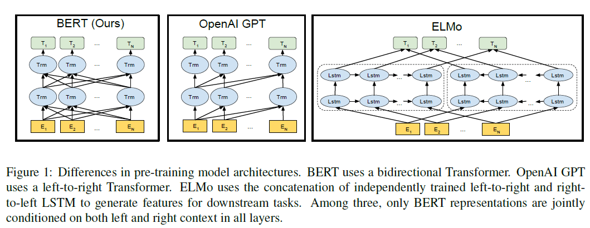

- BERT Pre-training of Deep Bidirectional Transformers for Language Understanding

| 项目     | 内容                                                         |
| :------- | ------------------------------------------------------------ |
| 时间     | 2018年                                                       |
| 作者单位 | Google                                                       |
| 作者信息 | Jacob Devlin,Ming-Wei Chang, Kenton Lee, Kristina Toutanova |
| 源码链接 |                                                              |
| 原文链接 | <https://arxiv.org/abs/1810.04805>                           |
| 其他解读 | https://blog.csdn.net/jilrvrtrc/article/details/83829470     |
| 关键词   | 预训练，迁移学习                                             |

  

  # 摘要

**Abstract**：本文作者推出了一套新的语言表达模型BERT，全称为Bidirectional Encoder Representations from Transformers。与近年来提出的语言模型不一样的地方在于，BERT不再仅仅是只关注一个词前文或后文的信息，而是整个模型的所有层都去关注其整个上下文的语境信息。实验结果证明，使用预训练过的BERT模型，仅仅在后面再包一层输出层，并对其进行微调训练，就可以将其应用到其他多种任务中，例如问答、语言推断等，**并且在这些后端任务中并不需要根据特定的任务需要对模型结构进行修改**。Bert是一种概念上简单，但在实际中却有强大的性能的模型。BERT在 11项自然语言处理任务中都取得了目前最好的性能，具体包括将GLUE的基准值提升到了80.4%(7.6%的绝对提升)，在MultNLI中准确率达到86.7的（5.6%的绝对提升），在SQuAD v1.1的问答任务中其F1值达到了93.2（1.5%）的绝对提升，比人类的表现都搞了2.0的提升。   

# 1.简介

​	语言预训练模型已经被证明能有效提升自然语言处理任务的性能。这些任务包括句子级别的任务如语言推理及解析，这些任务其目的是从句子级别推断句子间相互关系。此外还包括一些序列级别的任务，如命名实体识别，文本理解挑战任务（SQuAD），这些任务模型中需要在序列级别产生经过微调后的更好的结果。

​	目前有两种预训练的方法被用于下游处理任务中：**基于特征**的和**基于微调（fine-tuning）**的方法。在基于特征的方法中，**ELMO(2018)**是一种基于特征任务的模型，其包含一个预训练模型以及一些其他的特征。在微调模型中，OpenAI GPT(Generative Pre-trained Transform)引入了最小任务的参数，在下游任务中，其通过简单的微调的方式来调整模型的参数。在以前的工作中，所有的预训练方法都是通过使用同样的目标函数并通过双向语言模型来学习更好的通用语言表示。

​	在这篇文章中，我们任务目前的技术严重限制了预训练在语言表达方面的能力，特别是针对微调的方法。最大的缺陷是目前的预训练模型都是双向的，其严格限制了模型在进行预训练时的选择能力。例如在OpenAIGP中，作者使用了从左到右的模型，使得句子中每个token只能被以前的词所关注。这种方式对句子级别的任务是次优的(**sub-optimal**)，而在针对一些token级别的任务中，如SQuAD的问答问题中，则这种方法有可能是毁灭性的，因此在这些任务中，纳入两个方面的信息是至关重要的。

​	在这篇论文中，我们提出了一种基于微调的方法BERT:Bidirectional Encoder Representations from Transformers(基于双向翻译编码的表示模型)。BERT通过提出了两个新的预训练目标来解决以前的提到的单向限制问题：基于“masked”的语言模型（MLM），这种方法在1953年就曾经被提出。这种语言模型通过随机将输入句子中的token进行隐藏，然后预训练的目标就是基于上下文来预测出被覆盖掉的单词。不同于传统的从左到右的预训练语言模型，MLM训练目标使得我们能够充分利用左边和右边信息来训练一个更深的双向翻译模型。除了利用masked语言模型外，我们还在模型中引入了预测下一个句子的训练目标来同时训练句子对级别的表示模型。

​	这篇文章的贡献如下：

 - 在这篇文章中我们证明了双向预训练模型的重要性。不同于传统的双向预测模型，BERT使用了一种基于masked的语言模型来训练一种更深的语言模型。此外区别于传统的浅层双向语言模型，BERT是一种使用深层次的双向语言模型。
 - 我们展示了预训练模块可以消除在很多任务中需要依赖严重特征工程的任务。BERT 是第一个基于微调方法的语言表示模型，并且在sentence-levle和token-level级别的任务中都取得了较好的效果。在很多有特定需要的任务中也取得了较好的效果。
 - BERT 在11项自然语言处理任务中都取得了SOTA的结果。表明双向语言模型在文本处理中的重要性。

# 2.相关工作

​	在这节中我们介绍基于预训练的方式来生成语言表示模型的相关方方法，同时简要介绍一下在这个领域目前最流行的方法。

## 2.1 基于特征的方法

​	基于学习的词表示方法在多个领域都有广泛的应用。其中包括非神经元的方法和基于神经网络的方法。基于词嵌表示的预训练方法目前是现代语言处理系统中的一个重要集成部分，其对系统的后续处理提供了有强大的提升。除了词级别的词嵌外，这些方法也被推广到粗粒度的句子级别词嵌以及锻炼词嵌中。在传统的方法中，这些学习到的表示方法往往作为下游任务的特征输入到下游模型中。[ELMo(Peters et al.,2017)](Deep contextualized word representations.html)从另外一个重要角度来对词嵌进行处理。在该方法中，作者提出了从语言模型中提取出与上下文敏感特征的方法。通过将基于上下文敏感的词嵌和特定的任务结构相结合后，ELMo在很多自然语言处理任务中都取得了SOAT(State of the ART)的实验效果，包括基于SQuAD的问题，语义分析以及命名识别识别等众多的任务。

## 2.2 基于微调的方法

​	语言表示模型的一个新趋势就是通过利用语言模型预训练一个模型，让后基于迁移学习的方法将其迁移到其他的下游任务中，在下游任务中在对这些模型的参数进行微调。这些方法的一个优势就是只有较少的参数需要进行重新学习。在这方面的工作中，最新的一个工作[OpenAI GPT2018](Improving Language Understanding by Generative Pre-Training.html)基于迁移学习的方法在许多句子级别的任务中取得了SOTA的实验结果。

## 2.3 基于监督数据的迁移学习方法

​	无监督学习预训练方法的优势是有大量的无标签的数据可以大量的获取，基于有标签数据的迁移学习目前也被证明在许多文本处理任务中有较好的结果，例如自然语言推理、机器翻译等任务。除了在NLP处理领域外，很多机器视觉领域的研究也说明了预训练并集合迁移学习的重要方，这些方法通过在大量的预训练数据上进行训练后再通过微调的方式可以取得较好的实验结果。

# 3 . Bert模型介绍

​	在第三节中，详细介绍BERT模型机器实现细节。该节首选叙述Bert模块的整体框架及Bert的输入表示。接着在3.3节中介绍预训练的任务以及核心的创新。3.4节中介绍预训练的流程，而在3.5节中介绍微调的方法。最后在3.6节中讨论Bert和OpenAI GPT等结构的差别。

## 3.1 模块的结构

​	BERT是一个多层的基于双向转移编码器的模型，其根据tensor2tensor的方式来实践。BERT使用的“Transformer Encoder”编码器近来得到广泛的应用，因此本文中没有进行详细的介绍。

​	在该项工作中，作者定义了如下变量：

​	*L*:表示层级的数量（Transformer blocks）

​	*H* ：表示隐藏层数量

 	*A*:表示注意力header的数量。

​	bert有两个版本：BERTbase和BERTlarge,其中BERTbase的参数如下：L=12,H=768,A=12,而BERTlarge的数据L=24,H=1024,A=16.因此BERT base版本的参数有110M个，而BERT 的large版本的参数为340M个。

​	在BERT中，BERT使用的是一个双向的自注意力机制的编码模型，而OpenAI GPT中则是使用的一种从左到右的编码模型，引起BERT可以被看做迁移学习编码器，而OpenAI GPT则是一种迁移学习的解码器。BERT和OpenAI GPT的区别可以如图所示

	## 3.2 BERT的输入表示

​	在bert的输入中，对于一个输入token序列，该输入句子的序列表示可以由几部分构成：token序列表示，segment和position 的词嵌表示。图2中表示的是BERT的输入表示。

在BERT中输入被表示为两种形式：

- Token Embedding: 使用了包含30,000token的词库的WordPiece embedding方法来实现词嵌表示。
- Positional Embedding:使用了支持长度为512个token的词嵌表示方法。

​	在输入词序列中，序列的第一个词都是以[CLS]的方式开头，针对该token的 最后隐藏状态被用在分类任务的聚合表示中。而如果针对的是非分类任务，则该词对应的向量被删除掉。在句子对中，所有句子都被表示到一个序列任务中，我们通过两种不同的方式来区分。首先通过一个特殊的token[ESP]来对两个句子进行区分，在第一个句子中，每个句子的token会加上句子A的embedding表示，而在句子B中，每个token都会加上句子B的embedding表示。

​	如果输入是单个句子，则直接使用句子A的词嵌表示。

## 3.3 预训练任务

​	不像传统的从左到右或者从右到左的预训练语言模型任务，在BERT中使用了两种原创的无监督学习的预训练任务，分别是Masked LM和Next Prediction模型。

### 3.3.1  Masked LM

​	从初始概念上来将，一个更深层次的双向模型比传统的从左到有或者从右到左基于简单讲从左到右或者从右到左模型进行组合的方法有更好的效果。然后，目前传统的语言模型则往往只能通过从左到右或者从右到左的模型进行训练。在双向的环境中，句子中任意一个token都有可能被预测到在一个多层的网络环境中。

​	为了能够训练一个具有双向深层的表示模型，在bert中采用了一种较为直观的模型，通过随机隐藏掉句子中的token，并让模型能对该句子进行正确的预测。这种模型在BERT中被称为"masked LM"(MLM)模型。在该模型中，被隐藏掉的token会被输入到softmax模型中。在所有的预训练实验中，BERT采用15%的概率随机隐藏掉输入句子中的token. 区别于传统的auto-encoder模型，BERT的 训练任务只是预测被隐藏掉的单词而不是重新构建整个句子。

​	由于BERT会通过再训练的方式来微调模型的参数，而在再训练模型中，由于不在存在[MASK]信息，因此在训练中并不会隐藏掉所有的mask，而是通过以15%概率来选择那些单词被隐藏掉。此外在选择的被隐藏的单子中，采用如下措施来进行选择。

- 不是所有被选择的单词都会被隐藏掉，而是其中80%的可能会隐藏掉该单词，10%的时间将该单词替换成一个随机的单词。而另外还是有10的时间是该单词保持不变。

  

  ​	在Transformer模型中，由于encoder并不知道哪些单词可能会被替换成随机的单词，因此要求编码器能够学习到一种对所有单词都有表现的能力，此外随机替换只发在在1.5%的概率中，因此不会影响模型的整体理解能力。

  ​	由于在BERT中，有15%的 单词可能会被隐藏掉，因此在训练过程中其会花费较多的时间。

  ### 3.3.2 Next Sentence Predictioni

  ​	在 许多自然语言处理任务中，如问题回答，语言推理都依赖于推断两个句子的关系，而这种关系在部分的文本预处理模型中都没有捕获。为了能够训练一个模型能够对两个句子的关系进行推理，在BERT的预训练任务中，引入对对下一个句子预测的训练目标。在训练中，在一个句子对（sentence A,sentence B）中，一个句子B有50%是句子A的下一句，而50%的可能是随机另外一个句子。

  

  

  ​	在构建训练集时候，在选择句子A的下一个句子时，通过随机选择下一个句子的方式来实现构建训练集。

  ## 3.4 再训练流程

  

# 实验及结果

# 总结

​      

